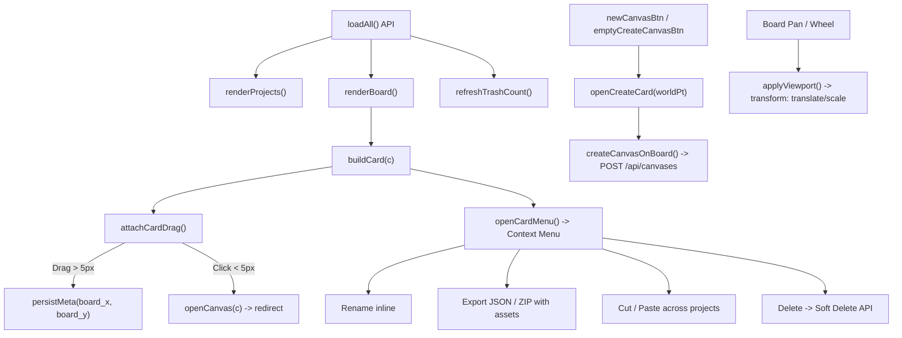

# Infinite Canvas — Phase 2A: Workspace Shell & Canvas Entry Experience Specification

**Document Version:** 2.0.0-draft (Design Audit & Specification)
**Author Role:** Senior Product Designer + UI Systems Designer
**Scope:** Workspace Entry Experience (`canvas-list.html`, `canvas-list.css`, `canvas-list.js`, and Stage integration in `index.html`)
**Design Reference:** Lovart-inspired AI Creative Workspace principles (No asset / trademark duplication)
**Implementation Status:** ⚠️ **AUDIT ONLY — DO NOT IMPLEMENT PRODUCT CODE IN THIS PHASE**

---

## 1. Current Workspace Audit

The Infinite Canvas Workspace (`/static/canvas-list.html`) serves as the primary project and canvas launcher for the application. It is accessed either as an independent full page or embedded inside the `iframe#frame-canvas` container of `index.html`.

### 1.1 Architecture & DOM Map

```text
div#workspace.workspace
├── aside#sidebar.ws-sidebar
│   ├── div.ws-side-head
│   │   ├── div.ws-side-title ("项目" / "Projects")
│   │   └── button#newProjectBtn.ws-side-add (Icon: plus)
│   ├── div#newProjectRow.ws-newproj-row (Inline creation form)
│   │   ├── input#newProjectInput.ws-newproj-input
│   │   ├── button#newProjectConfirm.ws-mini-btn.primary (Icon: check)
│   │   └── button#newProjectCancel.ws-mini-btn (Icon: x)
│   ├── div#projectList.ws-project-list (Scrollable list container)
│   │   └── [Dynamic div.ws-project-row[data-project-id]]
│   │       ├── span.ws-project-icon (Icon: folder / folder-open)
│   │       ├── span.ws-project-name ("默认项目", etc.)
│   │       ├── span.ws-project-count (Badge number)
│   │       └── span.ws-project-actions (Hover actions)
│   │           ├── button.ws-proj-act.rename (Icon: pencil)
│   │           └── button.ws-proj-act.del (Icon: trash-2, non-default projects only)
│   └── div.ws-side-foot
│       └── button#trashEntry.ws-trash-entry
│           ├── i[data-lucide="trash-2"]
│           ├── span.ws-trash-label ("回收站" / "Trash")
│           └── span#trashBadge.ws-trash-badge ("0")
│
└── main.ws-main
    ├── div.ws-topbar (Header toolbar)
    │   ├── div.ws-topbar-left
    │   │   ├── div#boardProjectName.ws-board-name ("默认项目")
    │   │   └── span#boardCanvasCount.ws-board-count ("0")
    │   └── div.ws-topbar-right
    │       ├── button#pasteCanvasBtn.ws-paste-btn (Clipboard cut/paste, hidden by default)
    │       ├── button#boardResetView.ws-icon-btn (Locate/Center view)
    │       ├── button#boardRefresh.ws-icon-btn (Reload data)
    │       └── button#newCanvasBtn.ws-primary-btn (Primary CTA: "新建画布")
    │
    ├── div#board.ws-board (Pannable / zoomable virtual coordinate surface)
    │   ├── div#boardWorld.ws-board-world (World transform host: translate(X,Y) scale(S))
    │   │   ├── [Dynamic div.ws-card[data-canvas-id]] (Draggable canvas cards)
    │   │   │   ├── div.ws-card-top
    │   │   │   │   ├── span.ws-card-kind (.smart / .classic badge)
    │   │   │   │   └── button.ws-card-menu (Icon: more-horizontal)
    │   │   │   ├── div.ws-card-title (Text or inline rename input)
    │   │   │   ├── div.ws-card-meta (Footer metadata pill)
    │   │   │   │   ├── span.ws-card-nodes ("N 节点")
    │   │   │   │   ├── span.ws-card-meta-dot
    │   │   │   │   └── span.ws-card-time ("MM-DD HH:mm")
    │   │   │   └── div.ws-card-delete-confirm (Inline delete confirmation)
    │   │   └── [Dynamic div.ws-create-card] (Inline creation popover spawned at cursor)
    │   └── div#boardEmptyHint.ws-board-empty (Empty state placeholder)
    │       ├── div.ws-board-empty-icon
    │       ├── div.ws-board-empty-text ("暂无画布")
    │       ├── div.ws-board-empty-sub ("为当前项目创建第一块画布")
    │       └── div.ws-board-empty-actions
    │           └── button#emptyCreateCanvasBtn.ws-primary-btn
    │
    ├── div#trashPanel.ws-trash-panel (Full-board modal overlay)
    │   ├── div.ws-trash-head (Title + close button)
    │   ├── div.ws-trash-note (30-day auto-purge policy banner)
    │   └── div#trashList.ws-trash-list (Grid of .ws-trash-card items)
    │
    └── div#boardStatus.ws-status (Bottom toast notification)
```

### 1.2 CSS Selector Map (`canvas-list.css`)

| Selector Category | Existing Selectors |
|---|---|
| **Root & Layout** | `:root`, `.theme-dark`, `body`, `.workspace`, `html[data-studio-scale="off"].studio-scale-managed .workspace` |
| **Sidebar Components** | `.ws-sidebar`, `.ws-side-head`, `.ws-side-title`, `.ws-side-add`, `.ws-newproj-row`, `.ws-newproj-input`, `.ws-mini-btn`, `.ws-project-list`, `.ws-project-row`, `.ws-project-icon`, `.ws-project-name`, `.ws-project-name-input`, `.ws-project-count`, `.ws-project-actions`, `.ws-proj-act`, `.ws-project-confirm`, `.ws-side-foot`, `.ws-trash-entry`, `.ws-trash-badge` |
| **Main & Topbar** | `.ws-main`, `.ws-topbar`, `.ws-topbar-left`, `.ws-board-name`, `.ws-board-count`, `.ws-topbar-right`, `.ws-icon-btn`, `.ws-primary-btn`, `.ws-paste-btn` |
| **Board Virtual Stage** | `.ws-board`, `.ws-board.panning`, `.ws-board-world`, `.ws-board-empty`, `.ws-board-empty-icon`, `.ws-board-empty-text`, `.ws-board-empty-sub`, `.ws-board-empty-actions` |
| **Canvas Card System** | `.ws-card`, `.ws-card:hover`, `.ws-card.dragging`, `.ws-card.cc-marked`, `.ws-card.cut`, `.ws-card-top`, `.ws-card-icon`, `.ws-card-kind`, `.ws-card-menu`, `.ws-card-title`, `.ws-card-title-input`, `.ws-card-meta`, `.ws-card-meta-dot`, `.ws-card-time`, `.ws-card-nodes`, `.ws-card-actions`, `.ws-card-delete-confirm` |
| **Context Menus & Modals** | `.ws-card-pop`, `.ws-pop-item`, `.ws-pop-sep`, `.ws-pop-sub-title`, `.ws-pop-proj`, `.ws-pop-scroll`, `.ws-create-card`, `.ws-create-title`, `.ws-create-input`, `.ws-create-toggle`, `.ws-create-actions` |
| **Trash Management** | `.ws-trash-panel`, `.ws-trash-head`, `.ws-trash-note`, `.ws-trash-list`, `.ws-trash-empty`, `.ws-trash-card`, `.ws-trash-act`, `.ws-trash-confirm` |
| **Feedback** | `.ws-status`, `.ws-status.show` |

### 1.3 JavaScript Interaction Map (`canvas-list.js`)



### 1.4 Visual & UX Problem Map

1. **Lack of AI Creative Workspace Identity:**
   The current UI presents as an engineering dashboard or database admin interface. There is no sense of creative momentum, visual canvas previews, or AI inspiration.
2. **Heavy "Boxy" Card Aesthetics:**
   `.ws-card` uses a rigid `248px × 150px` rectangle with a hard 1px border and dense text. It lacks thumbnail previews of the canvas contents, making all canvases look identical unless the user reads the textual title.
3. **Overly Aggressive Typographic Weight:**
   Font weights of `850` and `800` are applied ubiquitously (`.ws-side-title`, `.ws-board-name`, `.ws-board-count`, `.ws-primary-btn`, `.ws-card-title`, `.ws-card-kind`). This creates constant visual competition and high cognitive fatigue.
4. **Disjointed Radius System:**
   Some buttons use `border-radius: 8px`, badge counters use `999px`, card pills use `6px`, and popup menus use `8px`. The radius rhythm is arbitrary rather than systematic.
5. **Dark Mode Contrast Clashing:**
   In dark mode, active sidebar items and primary buttons turn `#d8dee9` with `#0f172a` text (`canvas-list.css:257`), creating jarring high-contrast blocks that break the subdued dark studio atmosphere.
6. **Weak and Clinical Empty State:**
   `.ws-board-empty` displays a generic `mouse-pointer-click` icon with "暂无画布". It fails to explain what an Infinite Canvas is, offers no templates, and does not inspire creative action.
7. **Board Virtual Stage Confusion:**
   Because the board features an infinite dot grid, new users often confuse the workspace board with the actual editor canvas. The relationship between "Workspace Board (Card Organizer)" and "Smart Canvas (Editor)" is not visually differentiated.

### 1.5 Interaction Safety Boundary

> [!CAUTION]
> During Phase 2, the boundary between presentation styling and behavioral runtime must be strictly maintained:

| Component | Behavior Contract (DO NOT TOUCH) | Presentation Contract (SAFE TO OVERRIDE) |
|---|---|---|
| `#board` & `#boardWorld` | Pointer events for Pan/Zoom, `applyViewport()`, `screenToWorld()`, `viewport.scale` calculation | Background color, radial dot grid pattern, grid contrast |
| `.ws-card` | Absolute positioning (`left`, `top` in world px), 5px drag threshold, click-to-open redirect | Background surface, border, border-radius, box-shadow, typography, thumbnail presentation |
| `.ws-card-menu` | Event stopPropagation, popup anchoring coordinates, action dispatch | Icon size, hover background, border-radius |
| `#newCanvasBtn` / `.ws-create-card` | Coordinate-based card creation, keyboard Enter/Esc dispatch, POST `/api/canvases` payload | Button styling, radius, typography, modal styling |
| `#projectList` & `.ws-project-row` | Selection click handler, inline input replacement on rename, `pendingDeleteProjectId` | Row height, hover highlight, active surface, badge typography |
| `#trashPanel` | 30-day retention API calls, restore/purge actions | Panel background, typography, button surfaces, spacing |

---

## 2. Information Architecture & Hierarchy Redesign

### 2.1 Current vs. Proposed Hierarchy

```text
CURRENT HIERARCHY (Engineering-focused)
Level 1: .workspace (Two-pane flex layout)
  ├── Level 2: .ws-sidebar (Project tree only)
  └── Level 2: .ws-main (Top bar + pannable card board)
        ├── Level 3: .ws-topbar (Title + 4 equal-weight utility buttons)
        └── Level 3: .ws-board (Pannable board with free-floating cards)
```

```text
PROPOSED HIERARCHY (Lovart-inspired Creative Studio)
Level 1: Workspace Shell
  ├── Level 2: Studio Navigation Sidebar (260px)
  │     ├── Header: Studio Brand & Quick New Canvas Action
  │     ├── Section A: Creative Views (All Canvases, Recent, Favorites)
  │     ├── Section B: Projects / Folders (Folder tree with subtle counts)
  │     └── Footer: Trash & Storage Health
  │
  └── Level 2: Studio Stage & Canvas Gallery
        ├── Level 3: Workspace Header (Breadcrumb / Title + View Mode + Primary CTA)
        ├── Level 4: Project Filter & Search Bar
        └── Level 5: Canvas Surface
              ├── State A: Populated Canvas Board / Gallery Grid
              │     └── Creative Canvas Cards (Thumbnail + Metadata + Actions)
              └── State B: Welcoming Empty State (Guidance + Quick Start Templates)
```

---

## 3. Lovart Design Principles & Infinite Canvas Application

| Lovart Studio Principle | Infinite Canvas Phase 2 Application |
|---|---|
| **Quiet, neutral work environment** | Eliminate colored backgrounds; use warm-neutral `#F5F5F4` (Light) and neutral deep charcoal `#121212` (Dark) from `ui-foundation.css`. |
| **Border over heavy drop shadow** | Replace bulky card shadows (`box-shadow: 0 16px 36px`) with crisp 1px borders (`--ui-border-default`) and delicate 4px micro-shadows (`--ui-shadow-sm`). |
| **Visual-first card presentation** | Shift cards from text-only boxes to media-aware cards with an integrated thumbnail preview area (or refined graphic placeholders for new canvases). |
| **High-priority, dignified CTA** | "New Canvas" becomes a high-visibility, elegant accent pill button with clear iconography and subtle hover elevation, without garish gradients. |
| **Deliberate typography scale** | Replace `850` font-weights with a disciplined ramp: `600` for titles, `500` for navigation labels, `400` for metadata. |
| **Soft spatial transitions** | Consistent `160ms cubic-bezier(.4, 0, .2, 1)` transitions on all cards, buttons, and row items. |

---

## 4. Component Design Specifications

### 4.1 Primary Action: "Create / New Canvas" CTA

The "New Canvas" button is the primary creative entry point.

```css
/* Specification for .ws-primary-btn */
.ws-primary-btn {
    height: 38px;
    padding: 0 16px;
    border-radius: var(--ui-radius-sm); /* 8px */
    background: var(--ui-accent);
    color: var(--ui-text-on-accent);
    font-size: var(--ui-text-sm);      /* 12px */
    font-weight: var(--ui-weight-semibold); /* 600 */
    border: 1px solid transparent;
    display: inline-flex;
    align-items: center;
    gap: var(--ui-space-2);            /* 8px */
    box-shadow: var(--ui-shadow-xs);
    transition: background var(--ui-duration-normal) var(--ui-ease-standard),
                transform var(--ui-duration-fast) var(--ui-ease-standard),
                box-shadow var(--ui-duration-fast) var(--ui-ease-standard);
}
.ws-primary-btn:hover {
    background: var(--ui-accent-hover);
    box-shadow: var(--ui-shadow-sm);
    transform: translateY(-1px);
}
.ws-primary-btn:active {
    transform: translateY(0);
}
.ws-primary-btn:focus-visible {
    outline: none;
    box-shadow: var(--ui-focus-ring);
}
```

### 4.2 Project Card System (`.ws-card`)

Cards must transition from a flat "database record" to a tangible "creative document".

```
┌────────────────────────────────────────────────┐
│  [Preview Thumbnail Area / Subtle Pattern]     │
│  Aspect Ratio: 16:9 or 3:2                     │
│  (Displays canvas snapshot or minimal badge)   │
├────────────────────────────────────────────────┤
│  Canvas Title                              [⋯] │
│  Kind Badge (Smart / Classic)                  │
│                                                │
│  19 nodes  •  Updated 2 hours ago              │
└────────────────────────────────────────────────┘
```

#### Card States
- **Default:** Solid surface (`--ui-bg-surface`), 1px border (`--ui-border-default`), 10px radius (`--ui-radius-md`), subtle shadow (`--ui-shadow-xs`).
- **Hover:** Border shifts to `--ui-border-strong`, elevation increases to `--ui-shadow-md`, transform lifts `translateY(-2px)`.
- **Dragging:** Cursor `grabbing`, shadow elevates to `--ui-shadow-floating`, opacity `0.95`, z-index `50`.
- **Context Menu Open:** Border locked to `--ui-border-strong`, shadow locked to `--ui-shadow-sm`.
- **Delete Confirming:** Surface transitions to `--ui-danger-soft`, border to `--ui-danger`, displaying inline confirm buttons.

### 4.3 Sidebar System (`.ws-sidebar`)

- **Width:** Fixed `260px` (contracted from 272px for better proportion).
- **Background:** `--ui-bg-surface-overlay` with `backdrop-filter: blur(20px)`.
- **Border:** Right 1px border `--ui-border-subtle`.
- **Project Rows (`.ws-project-row`):**
  - Height: `36px` (down from 40px for higher information density).
  - Radius: `8px` (`--ui-radius-sm`).
  - Active state: Subtle elevated surface `--ui-bg-soft` with text `--ui-text-primary` and left 3px accent bar, rather than an inverted black block.
  - Action icons (Rename, Delete): Clean ghost buttons appearing on hover with 14px Lucide icons.
- **Trash Entry (`.ws-trash-entry`):** Positioned at bottom with soft danger hover state.

### 4.4 Welcoming Empty State (`.ws-board-empty`)

```
┌─────────────────────────────────────────────────────────┐
│                          ┌───┐                          │
│                          │ ✦ │                          │
│                          └───┘                          │
│                    开启您的无限创意画布                 │
│   自由组织图像、视频与 AI 工作流，构建无边界的故事板    │
│                                                         │
│                  [ + 新建智能画布 ]                     │
└─────────────────────────────────────────────────────────┘
```

- **Title:** "开启您的无限创意画布" (Inspiring, creative).
- **Description:** "自由组织图像、视频与 AI 工作流，构建无边界的故事板。"
- **CTA:** Prominent primary button linking directly to create canvas.
- **Icon:** Subtle `sparkles` or `layout-grid` icon container with 12px radius and `--ui-bg-soft`.

---

## 5. Design Token Mapping for Phase 2

All styling in Phase 2 will exclusively consume tokens established in Phase 1 (`ui-foundation.css`):

| Workspace Element | Old Hardcoded Value | Mapped Design Token |
|---|---|---|
| Page Background | `#f6f7f9` / `#10141d` | `var(--ui-bg-canvas)` |
| Sidebar Surface | `rgba(255,255,255,.9)` | `var(--ui-bg-surface-overlay)` |
| Card Surface | `rgba(255,255,255,.98)` | `var(--ui-bg-surface)` |
| Card Surface (Raised/Hover) | `#fff` | `var(--ui-bg-surface-raised)` |
| Default Border | `#e5e9ef` / `#2d394c` | `var(--ui-border-default)` |
| Subtle Divider | `rgba(100,116,139,.18)` | `var(--ui-border-subtle)` |
| Primary Text | `#151922` / `#f4f7fb` | `var(--ui-text-primary)` |
| Secondary Text | `#5f6b7a` / `#c4cedb` | `var(--ui-text-secondary)` |
| Muted/Faint Text | `#98a2b3` / `#8c98aa` | `var(--ui-text-tertiary)` |
| Card Radius | `8px` | `var(--ui-radius-md)` (10px) |
| Button Radius | `8px` | `var(--ui-radius-sm)` (8px) |
| Badge Radius | `999px` / `6px` | `var(--ui-radius-pill)` (999px) |
| Standard Shadow | `0 6px 18px rgba(15,23,42,.06)` | `var(--ui-shadow-xs)` |
| Hover Shadow | `0 16px 36px var(--shadow-strong)`| `var(--ui-shadow-md)` |
| Dragging Shadow | `0 20px 48px var(--shadow-strong)`| `var(--ui-shadow-floating)` |

---

## 6. DOM Modification Budget (Safety Analysis)

To prevent runtime JavaScript breakage, every planned DOM adjustment is audited below:

| Proposed Change | Category | JS Selector Impact | Verdict |
|---|---|---|---|
| Link `ui-foundation.css` & `ui-canvas-list.css` in `canvas-list.html` | **SAFE DOM ADDITION** | None | ✅ Permitted in Phase 2B |
| Override `.ws-card` padding, typography, border, and shadows via CSS | **CSS ONLY** | None | ✅ Permitted in Phase 2B |
| Override `.ws-sidebar` width, row height, and active states via CSS | **CSS ONLY** | None | ✅ Permitted in Phase 2B |
| Override `.ws-topbar` buttons and header typography via CSS | **CSS ONLY** | None | ✅ Permitted in Phase 2B |
| Redesign `.ws-board-empty` text and icon markup in `canvas-list.html` | **SAFE DOM ADDITION** | Preserves `#boardEmptyHint` and `#emptyCreateCanvasBtn` IDs | ✅ Permitted in Phase 2B |
| Add a decorative thumbnail container inside `buildCard()` | **BEHAVIOR SENSITIVE** | Must not alter `.ws-card-top`, `.ws-card-menu`, or card mousedown propagation | ⚠️ Defer to Phase 2C or handle via pure CSS pseudo-elements |
| Restructure `#board` or `#boardWorld` | **DO NOT TOUCH** | Breaks `screenToWorld()`, `resetView()`, and card dragging | ❌ Strictly Forbidden |
| Alter `data-canvas-id` or `data-project-id` attributes | **DO NOT TOUCH** | Breaks project switching, rename, cut/paste, and deletion | ❌ Strictly Forbidden |

---

## 7. Recommended Implementation Sequence for Phase 2

When execution authorization is granted, Phase 2 should proceed in three disciplined sub-phases:

```text
Phase 2A (Current) ────► Phase 2B (Foundation & Chrome) ────► Phase 2C (Cards & Polish)
  [Audit & Spec]           - Create ui-canvas-list.css           - Card visual refresh
                           - Link tokens in canvas-list.html      - Empty state enhancement
                           - Sidebar & Topbar reskin             - Light/Dark theme QA
                           - Verify zero JS regression           - Baseline closeout
```

---

## 8. Verification & QA Checklist for Phase 2 Execution

When Phase 2 implementation begins, the following checks must pass:
- [ ] Server startup without errors
- [ ] Project switching (Sidebar click -> board re-renders)
- [ ] New project creation (Inline input -> Enter -> POST `/api/projects`)
- [ ] Project rename (Pencil icon -> inline edit -> persist)
- [ ] Project deletion (Trash icon -> confirmation -> canvases move to Default)
- [ ] Canvas board Pan (Drag on background -> smooth translation)
- [ ] Canvas board Zoom (Mouse wheel -> zoom centered on cursor)
- [ ] Reset View button (Centers all cards within view bounds)
- [ ] Card Drag vs Click (Drag > 5px moves card and saves position; Click < 5px opens editor)
- [ ] Card Context Menu (Rename, Export JSON, Export with assets, Cut, Delete)
- [ ] Cut & Paste across projects (Clipboard button appears -> moves canvas)
- [ ] Trash panel overlay (Open -> 30-day banner -> Restore / Purge)
- [ ] Light / Dark theme seamless toggle
- [ ] Browser Console: 0 JavaScript errors, 0 resource 404s
- [ ] Zero diff on `canvas-list.js`, `smart-canvas.js`, and `main.py`

---

## Phase 2B Implementation Notes

**Implementation branch:** `feature/ui-workspace-shell-v1`

### Scope delivered

- Added `static/css/ui-canvas-list.css` as an additive Workspace-only override layer.
- Loaded styles in the order `canvas-list.css` → `theme.css` → `ui-foundation.css` → `ui-canvas-list.css`.
- Migrated the Workspace canvas surface, 272px sidebar, topbar, primary CTA, secondary controls,
  floating menus, creation shell, trash shell, typography, focus states, and scrollbars to Phase 1
  `--ui-*` design tokens.
- Preserved the existing Workspace DOM, all IDs and data attributes, JavaScript event targets, and
  light/dark theme propagation.
- Kept the Project Card and empty-state structures frozen. Card overrides are limited to tokenized
  color, border, shadow, and typography; no dimensions, position model, or transforms were added.

### Geometry and runtime safety

- `#board` receives background properties only. Its padding, margin, border, position, dimensions,
  and transform remain controlled by the existing stylesheet/runtime.
- `#boardWorld` receives no Phase 2B override.
- `.ws-card` receives no width, height, position, inset, padding, margin, or transform override.
- `screenToWorld`, `applyViewport`, viewport state, drag thresholds, `board_x`, and `board_y` are unchanged.
- `static/js/canvas-list.js`, `static/js/smart-canvas.js`, and `main.py` have zero diff.
- Override audit: `!important` 0; `pointer-events` 0; `z-index` 0; `transform` declarations 0;
  geometry-affecting overrides on `#board`, `#boardWorld`, and `.ws-card` 0.

### Browser QA

Real Chrome verification covered Workspace load, populated project/card rendering, pan, cursor-centered
zoom, reset view, card drag, `board_x`/`board_y` persistence after reload, card click/open and return,
New Canvas creation, project creation and switching, Paste visibility/action, Refresh, Trash overlay,
context menu, and both Light and Dark themes. Temporary QA project/canvas records were removed by their
exact IDs after the checks. Browser console errors: 0. The Workspace HTML, legacy CSS, foundation CSS,
Phase 2B CSS, and JavaScript resources all returned HTTP 200.

### Screenshot evidence

Light-before, Light-after, and Dark-after states were visually captured and inspected in the controlled
Chrome session. Automated local-file export was blocked by the browser security policy, so the required
`workspace_*_phase2b.png` files are not yet written to `docs/ui-redesign/screenshots/`. No alternate
browser or policy bypass was used.
